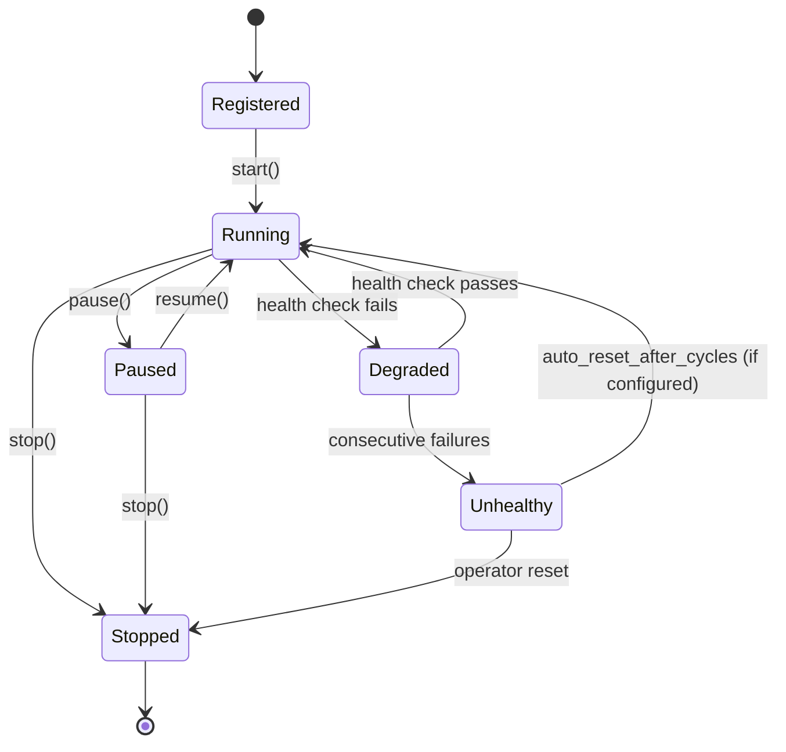

# Background Service Framework — Canonical Consolidation (#1983)

Maturity: **design-spec**. Rust implementation of phases 5–10 deferred to wire-up
issues tracked under #1877 / #1946.

This document is the single consolidated canonical design specification for the
TideFS unified background service framework. It supersedes the following documents,

| Superseded document | Issue(s) | Role |
|---|---|---|
| `docs/BACKGROUND_SERVICE_FRAMEWORK_DESIGN.md` | #1179 | Original spec (archived) |
| `docs/design/background-service-framework-design.md` | #1592, #1674 | Canonical scheduler design |
| `docs/design/background-service-framework-design-spec.md` | #1713 | 16-phase roadmap |
| `docs/design/background-service-framework-design-enhanced.md` | #1624 | Lifecycle, starvation, backpressure |
| `docs/design/background-service-framework-multithread-design.md` | #1625 | Multi-threaded work-stealing |
| `docs/design/background-service-framework-phases-5-10-wire-up-tracking.md` | #1946 | Phases 5–10 per-phase details |

**Source context:** lane `storage-core`, kind `design`.

---

## 1. Problem Statement

A storage system running in userspace must perform continuous background maintenance:
scrubbing checksums, reclaiming freed space, compacting B-trees, rebuilding derived
views, cleaning dead segments, and evaluating snapshot retention policies. In the
absence of a unified framework, each subsystem invents its own throttling, progress
tracking, and scheduling — producing inconsistent behaviour under load and opaque
operator visibility.

The current codebase (pre-#1179) exhibited exactly this pattern:

| Subsystem | Scheduling mechanism | Throttling |
|---|---|---|
| Block-level scrub | Ad-hoc scan loop | None |

### 1.1 Registered Background Services

| Service | Priority | Tick profile |
|---|---|---|
| Scrub | Critical | I/O-heavy, 20–100ms |
| Repair | Critical | Read-modify-write, 5–50ms |
| View builder | LatencySensitive | Metadata scan, 5–30ms |
| Reclaim | LatencySensitive | Spacemap walk, 10–40ms |
| Data cleaner | Throughput | Refcount delta processing, 10–60ms |
| Rebake | Throughput | Journal→base conversion, 20–100ms |
| Segment cleaner | BestEffort | Dead segment reclamation, 20–80ms |
| Compaction | BestEffort | B-tree node merge, 10–50ms |
| Prefetch | Opportunistic | Speculative read, 5–20ms |
| Orphan recovery | LatencySensitive | Orphan index walk, 10–30ms |
| Snapshot retention | BestEffort | Policy evaluation, 1–5ms |

### 1.2 Dependent Designs

| Dependent design | Background service needed |
|---|---|
| Cached directory/index views | View builder |
| Refcount delta cleanup queues | Data cleaner |
| Erasure coding and placement | Scrub + repair |
| Rebake architecture | Rebake conversion |
| Space accounting and cleaner scheduling | Segment cleaner |
| Snapshot retention | Retention evaluation |
| Unified lane scheduling | Background lane budget integration |
| BackgroundReclaim service | BackgroundReclaim |
| Reclaim delta recording | Delta processing in background tick |
| Polymorphic extent maps | Extent compaction |
| Online defrag/compaction | B-tree compaction |
| Orphan recovery | Orphan recovery |

---

## 2. Design Principles

1. **Unified scheduling** — One scheduler, one cycle, one budget pool. No per-subsystem
   ad-hoc loops.
2. **Priority-ordered fairness** — Higher-priority services always run before
   lower-priority ones; within each priority stage, services round-robin.
3. **Budget enforcement** — Every tick is bounded by items, bytes, and wall-clock
   milliseconds. No unbounded background work.
4. **Observable determinism** — Every scheduling decision is recorded in a `TickLog`
5. **Incremental progress** — Every service implements the `IncrementalJob` trait,
   advancing a cursor through a potentially infinite work domain.

---

## 3. Architecture

### 3.1 High-Level Structure

```
┌──────────────────────────────────────────────────────────────────────────┐
│                       BackgroundSchedulerPool                             │
│                                                                          │
│  ┌──────────────────────────┐    ┌─────────────────────────────────────┐│
│  │    Planning Thread        │    │          Worker Pool                ││
│  │    (FUSE event loop)      │    │                                     ││
│  │                           │    │  Worker 0: tick queue.dequeue       ││
│  │  plan_cycle(budget)      │    │  Worker 1: tick queue.dequeue       ││
│  │         │                 │    │  Worker 2: tick queue.dequeue       ││
│  │  ┌──────▼──────────┐     │    │  Worker 3: tick queue.dequeue       ││
│  │  │  TickWorkItem   │     │    │                                     ││
│  │  │  queue           │─────┼───▶│  Steal protocol: when idle,        ││
│  │  └─────────────────┘     │    │  steal from peer's local queue      ││
│  └──────…────────────────────┘    └─────────…───────────────────────────┘│
│                                                                          │
│  ┌──────────────────────────────────────────────────────────────────────┐│
│  │                       Shared State                                    ││
│  │  ┌──────────────┐  ┌───────────────────┐  ┌───────────────────────┐  ││
│  │  │ ServiceRegistry│  │ StarvationTracker │  │ DemandPressureGauge  │  ││
│  │  └──────────────┘  └───────────────────┘  └───────────────────────┘  ││
│  │  ┌──────────────┐  ┌───────────────────┐  ┌───────────────────────┐  ││
│  │  │PoolProperties │  │   TickLog (ring)  │  │ HealthState per svc   │  ││
│  │  └──────────────┘  └───────────────────┘  └───────────────────────┘  ││
│  └──────────────────────────────────────────────────────────────────────┘│
└──────────────────────────────────────────────────────────────────────────┘
```

The `BackgroundSchedulerPool` is created once per pool (filesystem dataset). The
planning thread runs on the FUSE daemon event loop. Worker threads execute service
ticks from a multi-producer, multi-consumer work queue. Idle workers steal from
peer workers' local Chase-Lev deques.

### 3.2 Tick Lifecycle

```
FUSE event loop cycle:
  1. plan_cycle(budget)  → produces Vec<TickWorkItem> ordered by priority
  2. enqueue all items    → push to MPMC work queue
  3. worker pool executes → each worker pops, runs service.tick(budget),
                            collects TickReport, appends to TickLog
  4. barrier: wait_all()  → all workers complete their dequeued items
  5. post_cycle()         → update StarvationTracker, adjust demand pressure
  6. sleep or next cycle  → if budget consumed early, sleep until next interval
```

### 3.3 Crate Map

| Crate | Role |
|---|---|
| `tidefs-background-scheduler` | Scheduler pool, tick dispatch, budget enforcement (implemented phases 1–4) |
| `tidefs-types-incremental-job-core` | `IncrementalJob` trait, `JobCursor`, `JobProgress`, `TickBudget` (implemented) |
| `tidefs-cleanup-job-core` | `CleanupJob`, refcount delta jobs (implemented) |
| `tidefs-reclaim-job-core` | `ReclaimJob`, spacemap-walk jobs (implemented) |
| `tidefs-orphan-recovery-job-core` | `OrphanRecoveryJob` (implemented) |
| `tidefs-local-filesystem` | BackgroundReclaim service wiring (implemented) |

---

## 4. Data Structures

### 4.1 `TickBudget`

```rust
pub struct TickBudget {
    pub max_items: u64,         // max work items per tick per service
    pub max_bytes: u64,         // max bytes processed per tick per service
    pub max_wall_ms: u64,       // max wall-clock milliseconds per tick per service
    pub lane: SchedulingLane,   // lane for I/O governor integration
}
```

The budget is applied per-service, per-tick. A service must stop when any of the
three limits (`max_items`, `max_bytes`, `max_wall_ms`) is reached.

### 4.2 `TickWorkItem`

```rust
pub struct TickWorkItem {
    pub service_id: ServiceId,
    pub service_name: String,
    pub priority: ServicePriority,
    pub budget: TickBudget,
    pub validity_token: ServiceValidityToken,
    pub starvation_pressure: f64,   // 0.0–1.0, derived from StarvationTracker
}
```

### 4.3 `TickReport`

```rust
pub struct TickReport {
    pub service_id: ServiceId,
    pub items_processed: u64,
    pub bytes_processed: u64,
    pub wall_ms: u64,
    pub budget_exhausted: BudgetExhaustion,
    pub cursor_advanced: bool,
    pub health: ServiceHealth,
    pub errors: Vec<ServiceError>,
}

pub enum BudgetExhaustion {
    None,
    Items,
    Bytes,
    WallTime,
    WorkDone,   // natural completion — no more work to do
}

pub enum ServiceHealth {
    Healthy,
    Degraded { reason: String },
    Unhealthy { reason: String },
}
```

### 4.4 `ServiceDescriptor`

```rust
pub struct ServiceDescriptor {
    pub id: ServiceId,
    pub name: String,
    pub priority: ServicePriority,
    pub min_interval_ms: u64,       // minimum time between ticks
    pub max_consecutive_ticks: u64,  // before forced yield
    pub feature_gate: Option<FeatureFlag>,
    pub unhealthy_cooldown_ticks: u64,  // ticks before auto-reset (0 = manual only)
    pub starvation_timeout_ms: u64,     // after which starvation-prevention kicks in
}
```

### 4.5 `ServiceValidityToken`

or its configuration changes. Workers check the token before executing a tick. If
the token is stale (does not match the current registry token), the work item is
discarded.

```rust
pub struct ServiceValidityToken(u64);  // monotonic generation counter
```

### 4.6 `ServiceState` (Lifecycle)



### 4.7 `StarvationTracker`

```rust
pub struct StarvationTracker {
    per_service_last_tick: HashMap<ServiceId, Instant>,
    starvation_timeout_ms: u64,
    starvation_override_pressure: f64,   // 1.0 = full override
}

impl StarvationTracker {
    /// Returns pressure [0.0, 1.0] for each service. A value >= 1.0
    /// means the service has exceeded its starvation timeout and must
    /// be dispatched at the next opportunity, even if lower-priority.
    pub fn pressure(&self, service_id: ServiceId) -> f64;

    /// Records that a service was ticked.
    pub fn record_tick(&mut self, service_id: ServiceId);

    /// Returns services sorted by starvation pressure (descending).
    pub fn starved_services(&self) -> Vec<(ServiceId, f64)>;
}
```

### 4.8 `DemandPressureGauge`

```rust
pub struct DemandPressureGauge {
    current_pressure: AtomicF64,      // 0.0–1.0
    enospc_boost: AtomicBool,        // set when ENOSPC observed
    consecutive_no_work: AtomicU64,  // cycles where all services idle
}

impl DemandPressureGauge {
    pub fn adjust(&self, reports: &[TickReport]);
    pub fn should_shrink_budget(&self) -> bool;
}
```

### 4.9 `TickLog`

```rust
pub struct TickLog {
    ring: RwLock<VecDeque<TickLogEntry>>,
    capacity: usize,        // default: 10,000 entries
    capture_mode: AtomicBool,
    replay_mode: AtomicBool,
}

pub struct TickLogEntry {
    pub cycle_id: u64,
    pub timestamp: Instant,
    pub items: Vec<TickReport>,
    pub budget: TickBudget,
    pub scheduler_decisions: Vec<SchedulerDecision>,
}
```

### 4.10 `PoolProperties`

```rust
pub struct PoolProperties {
    pub cycle_interval_ms: u64,          // default: 100ms
    pub global_max_items_per_cycle: u64,
    pub global_max_bytes_per_cycle: u64,
    pub global_max_wall_ms_per_cycle: u64,
    pub worker_count: usize,             // default: num_cpus / 2
    pub worker_queue_depth: usize,       // default: 64
    pub starvation_timeout_ms: u64,      // default: 60_000
    pub unhealthy_cooldown_ticks: u64,   // default: 10
    pub auto_reset_after_cycles: u64,    // default: 0 (disabled)
    pub per_service_overrides: HashMap<ServiceId, PerServiceProps>,
}

pub struct PerServiceProps {
    pub max_items: Option<u64>,
    pub max_bytes: Option<u64>,
    pub max_wall_ms: Option<u64>,
    pub min_interval_ms: Option<u64>,
}
```

### 4.11 `IncrementalJob` Trait

```rust
pub trait IncrementalJob: Send + Sync {
    fn cursor(&self) -> JobCursor;
    fn tick(&mut self, budget: &TickBudget) -> Result<TickReport, JobError>;
    fn progress(&self) -> JobProgress;
    fn reset(&mut self) -> Result<(), JobError>;
    fn checkpoint(&self) -> Result<Vec<u8>, JobError>;
    fn restore(&mut self, checkpoint: &[u8]) -> Result<(), JobError>;
}
```

---

## 5. Algorithms

### 5.1 `plan_cycle` — Main Scheduling Loop

```
Algorithm plan_cycle(pool: &BackgroundSchedulerPool, budget: TickBudget):
    let mut work_items = Vec::new()
    let registry = pool.registry.read()
    let starvation = pool.starvation_tracker.read()

    // Phase 1: Starvation overrides — starved services promoted to next cycle slot
    for svc in starvation.starved_services():
        if registry.is_running(svc.id):
            work_items.push(TickWorkItem {
                service_id: svc.id,
                priority: svc.priority,
                starvation_pressure: svc.pressure,
                budget: scale_budget(budget, svc.priority),
                ..
            })

    // Phase 2: Priority-ordered dispatch
    for priority in [Critical, LatencySensitive, Throughput, BestEffort, Opportunistic]:
        let services = registry.services_by_priority(priority)
        let round_robin = pool.round_robin_cursor[priority]
        for i in 0..services.len():
            let svc = services[(round_robin + i) % services.len()]
            if svc.min_interval_elapsed() && svc.is_running():
                work_items.push(TickWorkItem {
                    service_id: svc.id,
                    priority: svc.priority,
                    starvation_pressure: starvation.pressure(svc.id),
                    budget: scale_budget(budget, svc.priority),
                    ..
                })
        pool.round_robin_cursor[priority] += 1

    // Phase 3: Budget clamp — respect global per-cycle limits
    work_items.truncate_by_global_budget(budget)

    // Phase 4: Log decisions
    pool.tick_log.record_scheduling(work_items.iter().map(|w| w.service_id))

    return work_items
```

### 5.2 Budget Scaling

Per-service budget is derived from the global budget scaled by priority weight:

| Priority | Weight | Share of global budget |
|---|---|---|
| Critical | 4 | 40% |
| LatencySensitive | 3 | 30% |
| Throughput | 2 | 20% |
| BestEffort | 1 | 10% |
| Opportunistic | 0 | only when idle (no other work) |

Opportunistic services receive no guaranteed budget share. They execute only when
no higher-priority service has work in the queue.

### 5.3 Worker Execution Loop

```
Algorithm worker_loop(worker_id: usize, pool: &BackgroundSchedulerPool):
    loop:
        item = pool.work_queue.dequeue()
        if item is None:
            item = steal_from_peer(pool, worker_id)
            if item is None:
                if pool.all_workers_idle():
                    break
                continue

        // Validity check
        if !pool.registry.is_token_valid(item.service_id, item.validity_token):
            continue

        // Execute tick
        let svc = pool.registry.get_service_mut(item.service_id)
        let start = Instant::now()
        let report = svc.tick(&item.budget)
        let elapsed = start.elapsed().as_millis()

        // Record
        pool.tick_log.record_execution(item.cycle_id, &report)
        pool.starvation_tracker.record_tick(item.service_id)

        // Health check
        if report.health != ServiceHealth::Healthy:
            pool.health_tracker.record(item.service_id, &report.health)

        // Yield if budget consumed
        if elapsed >= item.budget.max_wall_ms:
            pool.work_queue.requeue_front(item)  // reschedule remaining work
```

### 5.4 Work-Stealing Protocol

Each worker maintains a Chase-Lev work-stealing deque. When a worker's local
deque is empty, it randomly selects a peer and attempts to steal from the peer's
deque tail.

```
Algorithm steal_from_peer(pool: &BackgroundSchedulerPool, my_id: usize):
    let peers = (0..pool.worker_count).filter(|i| *i != my_id)
    let victim = peers.choose_random()
    let stolen = pool.local_queues[victim].steal()
    return stolen
```

Work-stealing is lock-free for the owner (push/pop from head) and requires a
single CAS for the thief (pop from tail), following the Chase-Lev algorithm.

### 5.5 Starvation Prevention

A service starves when it has not been ticked for `starvation_timeout_ms` (default:
60s). When starvation pressure reaches 1.0:

1. The service is promoted to the head of the next cycle's dispatch.
2. Its tick budget is temporarily doubled (up to 2× normal allocation).
3. Once ticked, pressure resets to 0.0.

Starvation tickets do not count against the global per-cycle budget — they are
guaranteed to run.

### 5.6 Backpressure and Demand Pressure

```
Algorithm adjust_demand_pressure(pool: &BackgroundSchedulerPool):
    let total_items = sum(reports.items_processed)
    let total_capacity = pool.props.global_max_items_per_cycle
    let utilization = total_items / total_capacity

    // Pressure rises as utilization approaches capacity
    pool.demand_pressure.current_pressure = clamp(utilization * 1.2, 0.0, 1.0)

    // ENOSPC boost
    if pool.demand_pressure.enospc_boost:
        pool.demand_pressure.current_pressure = 1.0

    // Shrink budget when pressure > 0.8
    if pool.demand_pressure.current_pressure > 0.8:
        pool.props.global_max_items_per_cycle *= 0.8
        pool.props.global_max_bytes_per_cycle *= 0.8
```

When pressure subsides (pressure < 0.3 for 10 consecutive cycles), the budget
is restored.

### 5.7 Health State Machine

Services transition through health states:

- **Healthy → Degraded**: `tick()` returns `ServiceHealth::Degraded`. The service
  continues to be scheduled.
- **Degraded → Healthy**: Next `tick()` returns `Healthy`.
- **Degraded → Unhealthy**: `unhealthy_cooldown_ticks` (default: 10) consecutive
  `Degraded` results. The service is removed from the scheduling pool.
- **Unhealthy → Stopped**: Operator issues `tidefs service reset <name>`.
- **Unhealthy → Running**: If `auto_reset_after_cycles > 0`, after that many
  cycles the service auto-recovers.

---

## 6. Service Taxonomy

### 6.1 Priority Stages

| Stage | Meaning | Allocation |
|---|---|---|
| **Critical** | Data integrity and repair. Latency directly impacts durability. | Guaranteed budget, always runs first. |
| **LatencySensitive** | User-visible metadata operations: view refresh, reclaim. | Guaranteed budget after Critical. |
| **Throughput** | Bulk data movement: rebake, data cleaner. | Guaranteed budget after LatencySensitive. |
| **BestEffort** | Non-urgent maintenance: compaction, segment cleaning. | Remaining budget after higher stages. |
| **Opportunistic** | Speculative work: prefetch. | Only when no other work exists. |

### 6.2 Per-Service Definitions

| Service | Priority | Stage | Feature Gate | min_interval_ms | max_consecutive_ticks |
|---|---|---|---|---|---|
| Scrub | Critical | 0 | `bg_scrub` | 20 | 5 |
| Repair | Critical | 0 | `bg_repair` | 5 | 3 |
| ViewBuilder | LatencySensitive | 1 | `bg_view_builder` | 10 | 4 |
| Reclaim | LatencySensitive | 1 | `bg_reclaim` | 20 | 4 |
| OrphanRecovery | LatencySensitive | 1 | `bg_orphan_recovery` | 30 | 2 |
| DataCleaner | Throughput | 2 | `bg_data_cleaner` | 50 | 3 |
| Rebake | Throughput | 2 | `bg_rebake` | 100 | 2 |
| SegmentCleaner | BestEffort | 3 | `bg_segment_cleaner` | 80 | 2 |
| Compaction | BestEffort | 3 | `bg_compaction` | 50 | 4 |
| Retention | BestEffort | 3 | `bg_retention` | 5_000 | 1 |
| Prefetch | Opportunistic | 4 | `bg_prefetch` | 500 | 1 |

---

## 7. Integration Points

### 7.1 FUSE Daemon Main Loop

The background scheduler is driven from the FUSE event loop on each iteration:

```rust
// In tidefs-fuse daemon main loop:
loop {
    // Handle pending FUSE requests
    fuse_session.process_requests(timeout)?;

    // Background service tick
    if pool_props.cycle_interval_elapsed() {
        let work_items = background_pool.plan_cycle(&pool_props);
        background_pool.enqueue_cycle(work_items);
    }

    // Admin command processing
    admin_server.poll()?;
}
```

### 7.2 Admin Protocol

Operator commands via the admin wire protocol (`tidefs service *`):

```
tidefs service status                   → list all services, state, last tick
tidefs service pause <name>             → pause a service
tidefs service resume <name>            → resume a paused service
tidefs service stop <name>              → stop and deregister
tidefs service reset <name>             → reset unhealthy → stopped
tidefs service budget <name> <items> <bytes> <ms>  → override per-service budget
tidefs service pool-props show          → show PoolProperties
tidefs service pool-props set <key> <val>  → set a pool property
```

### 7.3 I/O Governor Integration

Each `TickWorkItem` carries a `SchedulingLane` that the I/O governor uses to
allocate I/O bandwidth within the tick. The lane mapping follows the
`unified-scheduling-classes-lane-priority-model.md` design:

| Priority | I/O Lane |
|---|---|
| Critical | `Lane::MetadataCritical` |
| LatencySensitive | `Lane::MetadataBackground` |
| Throughput | `Lane::DataBackground` |
| BestEffort | `Lane::DataBestEffort` |
| Opportunistic | `Lane::Idle` |

### 7.4 Deterministic Replay

The `TickLog` captures all scheduling decisions and execution outcomes. It
integrates with the trace oracle system (`docs/design/deterministic-trace-oracle-system.md`)

- **Capture mode**: Records every cycle's plan and execution reports.
- **Replay mode**: Reads a captured trace, replays scheduling decisions, and
  asserts identical outcomes.
  regressions.

---

## 8. Tradeoffs

### 8.1 Throughput vs. Critical Priority

Under heavy I/O pressure, Critical-priority services (scrub, repair) consume most
of the budget, starving BestEffort services (compaction, segment cleaning). This
is intentional: data integrity trumps space efficiency. However, this means that
under sustained Critical load, the pool can exhaust free space due to deferred
reclamation.

**Mitigation**: Starvation prevention promotes BestEffort services after 60s,
with a doubled budget. The operator can lower `starvation_timeout_ms` to accelerate
reclamation at the cost of scrub throughput.

### 8.2 FIFO vs. Largest-First Dispatch

The round-robin policy ensures every service in a priority stage gets a tick before
any service gets a second tick within the same cycle. This is fair but can be
suboptimal when one service has a huge backlog and another has trivial work.

**Decision**: FIFO (round-robin). Largest-first would starve small-work services.
The operator can override per-service budgets to give backlog-heavy services more
time per tick.

### 8.3 Per-Dataset vs. Global Scheduling

A single `BackgroundSchedulerPool` per dataset provides isolation: one pool's
maintenance does not affect another. A global scheduler would provide fairness
across pools but adds complexity.

**Decision**: Per-dataset pools with global budget divided by pool weight. The
operator assigns pool weights via `PoolProperties`. A global administrator can
view/override budgets across pools.

### 8.4 Inline FUSE Thread vs. Dedicated Planner Thread

Planning (`plan_cycle`) runs on the FUSE event loop thread. For <20 services,
this completes in <500µs, well within the event loop budget. A dedicated planner
thread would add coordination overhead (shared state locking) for negligible
gain.

**Decision**: Start inline; profile; add a dedicated planner thread only if
profiling shows >500µs planning time. This is deferred to phase 16.

### 8.5 Single-Threaded vs. Multi-Threaded Execution

The current implementation executes ticks inline on the FUSE event loop thread.
For short ticks (<10ms), this is acceptable. For longer ticks (deep scrub, rebake),
this increases FUSE operation tail latency.

**Decision**: Multi-threaded work-stealing (phases 11–13). The planning thread
produces work items; worker threads execute them in parallel. The FUSE event loop
blocks only during `plan_cycle` and `post_cycle`, both of which are <1ms.

### 8.6 Crash Safety: Derived Catalog

Derived catalog views (built by ViewBuilder) can either be persisted (survive
daemon crash, avoid cold-start rebuild latency) or be discarded (simpler, no
crash-consistency bugs).

discard and rebuild if inconsistent.

### 8.7 Auto-Recovery of Unhealthy Services

A service that repeatedly returns `Degraded` may be experiencing a transient
condition (e.g., a temporarily full disk). Auto-recovery (`auto_reset_after_cycles`)
enables hands-off recovery but risks flapping (unhealthy → running → unhealthy).

**Decision**: Default `auto_reset_after_cycles = 0` (manual reset only). Operators
who understand their workload can enable auto-recovery via pool properties.

---

## 9. Wire-Up Roadmap (16 Phases)

| Phase | Scope | Status | Dependencies |
|---|---|---|---|
| **Phase 1** | `IncrementalJob` trait, `TickBudget`, `JobCursor`, `JobProgress` | ✅ Implemented | — |
| **Phase 2** | `BackgroundScheduler` core: registry, dispatch, budget enforcement | ✅ Implemented | Phase 1 |
| **Phase 3** | `ServiceState` machine, validity tokens, `ServiceDescriptor` | ✅ Implemented | Phase 2 |
| **Phase 4** | `ServicePriority`, round-robin dispatch, per-priority cursors | ✅ Implemented | Phase 2 |
| **Phase 5** | `ViewBuilderService` — derived catalog build/serve/evict/compact | 🔲 Wire-up (#1946) | Phases 1–4 |
| **Phase 6** | `DataCleanerService` — refcount delta queue processing | 🔲 Wire-up (#1946) | Phases 1–4 |
| **Phase 7** | `RebakeService`, `SegmentCleanerService` — bulk data movement | 🔲 Wire-up (#1946) | Phases 1–4 |
| **Phase 8** | `CompactionService`, `RetentionService` | 🔲 Wire-up (#1946) | Phases 1–4 |
| **Phase 9** | `PrefetchService` (Opportunistic) | 🔲 Wire-up (#1946) | Phases 1–4 |
| **Phase 10** | `OrphanRecoveryService`, `ScrubService`, `RepairService` | 🔲 Wire-up (#1946) | Phases 1–4 |
| **Phase 11** | `BackgroundSchedulerPool`, work-stealing workers, tick isolation | 🔲 Wire-up | Phases 1–10 |
| **Phase 12** | `StarvationTracker`, starvation-prevention dispatch | 🔲 Wire-up | Phase 11 |
| **Phase 13** | `DemandPressureGauge`, budget shrink, Critical grace period | 🔲 Wire-up | Phase 11 |
| **Phase 14** | Admin protocol: `tidefs service *` commands | 🔲 Wire-up | Phases 11–12 |
| **Phase 15** | `TickLog`, capture/replay, trace-oracle integration | 🔲 Wire-up | Phases 11–13 |
| **Phase 16** | Core pinning, dedicated planner thread, budget auto-tuning | 🔲 Deferred to v1.1 | Phases 11–15 |

### 9.1 Phase 5–10 Wire-Up Template

Each wire-up issue MUST include:

1. **Service struct** implementing `IncrementalJob`
2. **Service registration** in `ServiceRegistry` with `ServiceDescriptor`
3. **Cursor schema** for persistent progress tracking
4. **Tick implementation** with budget enforcement
5. **Health reporting** via `TickReport`
6. **Feature gate** integration
7. **Unit tests** for state transitions, budget exhaustion, cursor advancement
8. **Integration test** in the per-pool test harness

### 9.2 Per-Subsystem Cursor Schemas (Phase 5–10)

| Service | Cursor type | Persisted in |
|---|---|---|
| ViewBuilder | `(dataset_id, catalog_root_commit_group, last_built_entry)` | Derived catalog B-tree |
| DataCleaner | `(dataset_id, refcount_queue_id, last_processed_seq)` | Cleanup queue head |
| Rebake | `(dataset_id, journal_offset, bytes_converted)` | Journal superblock |
| SegmentCleaner | `(dataset_id, segment_id, offset_in_segment)` | Spacemap allocator |
| Compaction | `(dataset_id, btree_id, level, last_merged_key)` | B-tree metadata page |
| Retention | `(dataset_id, last_evaluated_snapshot_id)` | Dataset properties |
| Prefetch | `(dataset_id, last_prefetch_offset)` | In-memory only (cold-start safe) |
| OrphanRecovery | `(dataset_id, orphan_index_entry_id)` | Orphan index |
| Scrub | `(dataset_id, block_offset, checksum_state)` | Scrub checkpoint file |
| Repair | `(dataset_id, repair_queue_entry_id)` | Repair queue (derived from scrub findings) |

---

## 10. Testing Strategy

### 10.1 Unit Tests

- `IncrementalJob` trait conformance: every service passes `tick()`, `cursor()`,
  `progress()`, `reset()`, `checkpoint()`/`restore()`.
- State machine transitions: verify every `ServiceState` edge.
- Budget exhaustion: verify correct `BudgetExhaustion` variant for items, bytes, wall-time.
- Round-robin fairness: verify per-priority cursor advances correctly across cycles.
- Validity token: verify stale tokens cause work-item discard.
- StarvationTracker: verify pressure calculation and record/reset semantics.

### 10.2 Integration Tests

- Multi-service cycle: register 3+ services at different priorities, run cycles,
  verify dispatch order and budget consumption.
- Starvation promotion: register 1 BestEffort service, run cycles without ticking
  it for >60s, verify it is promoted.
- Backpressure shrink: simulate high utilization, verify budget shrinks; simulate
  idle periods, verify budget restores.
- Health transitions: simulate a service returning Degraded for N consecutive
  ticks, verify Unhealthy transition.
- Work-stealing: register 4 workers, ensure work items are distributed and stolen.

### 10.3 Deterministic Replay Tests

- Capture a cycle trace with known inputs.
- Replay with identical inputs; assert identical scheduling decisions and execution
  outcomes.
- Replay with different inputs (seed, timing); assert that non-deterministic
  decisions are flagged by the trace oracle.


```bash
cargo test -p tidefs-background-scheduler -- --test-threads=1
```

For release-candidate or shared-surface changes:

```bash
```

---

## 11. Open Questions

1. **Starvation override threshold**: Default 60s, tunable via pool property.
   consistency at mount; discard and rebuild if inconsistent.
3. **Multi-pool scheduling**: Per-pool `BackgroundSchedulerPool` instances with
   global budget divided by pool weight.
4. **Service dependencies**: Not enforced by the scheduler; each service detects
   work via authoritative state.
5. **Budget auto-tuning**: Static weights with operator override; revisit in v1.1.
6. **Auto-recovery of unhealthy services**: Manual reset only by default;
   `auto_reset_after_cycles` property enables hands-off recovery.
7. **TickLog persistence**: In-memory ring buffer; dump on operator request.
8. **Core pinning**: Defer to v1.1; initial implementation uses OS-thread scheduling.
9. **Dedicated planner thread**: Start inline on FUSE event loop; add dedicated
   thread only if profiling shows >500µs planning time.
10. **Starvation tick budget accounting**: Starvation-prevention tick counts
    against the service's normal budget to maintain fairness.

---

## 12. References

- [#1179] Initial background service framework design →
  `docs/BACKGROUND_SERVICE_FRAMEWORK_DESIGN.md`
- [#1592] Canonical scheduler design →
  `docs/design/background-service-framework-design.md`
- [#1624] Enhanced design (lifecycle, starvation, backpressure) →
  `docs/design/background-service-framework-design-enhanced.md`
- [#1625] Multi-threaded work-stealing design →
  `docs/design/background-service-framework-multithread-design.md`
- [#1673][#1674] Design-spec →
  `docs/design/background-service-framework-design-spec.md`
- [#1713] 16-phase roadmap consolidation
- [#1858][#1859][#1877][#1980] Coordination seal & status tracking
- [#1946] Phases 5–10 wire-up tracking →
  `docs/design/background-service-framework-phases-5-10-wire-up-tracking.md`
- [#1992] Retired coordination confirmation, removed by #1586
- [#1983] This document — canonical consolidation
- `crates/tidefs-background-scheduler/src/lib.rs` — scheduler implementation (phases 1–4)
- `crates/tidefs-types-incremental-job-core/src/lib.rs` — `IncrementalJob` trait and types
- `docs/design/incremental-job-core-types-crate-design.md` — IncrementalJob type design
- `docs/design/incremental-job-core-wire-up-deferred-design.md` — wire-up deferred design
- `docs/design/unified-scheduling-classes-lane-priority-model.md` — lane scheduling design
- `docs/design/admin-service-wire-protocol.md` — admin protocol for CLI commands
- `docs/design/deferred-cleanup-background-service-scheduling.md` — cleanup scheduling architecture
- `docs/design/deferred-cleanup-work-queues.md` — cleanup work queues
- Chase-Lev, "Dynamic Circular Work-Stealing Deque", SPAA 2005
- Blumofe & Leiserson, "Scheduling Multithreaded Computations by Work Stealing", JACM 1999
